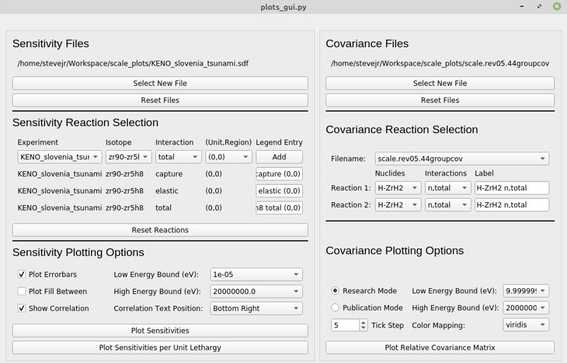
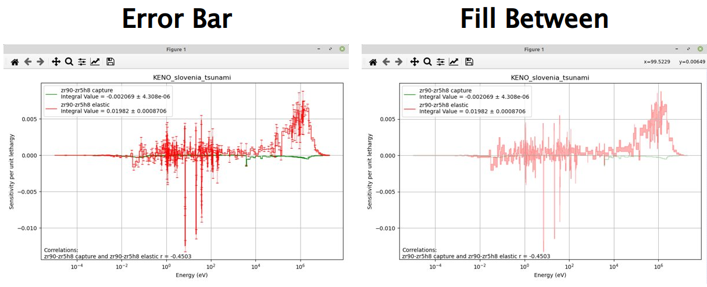
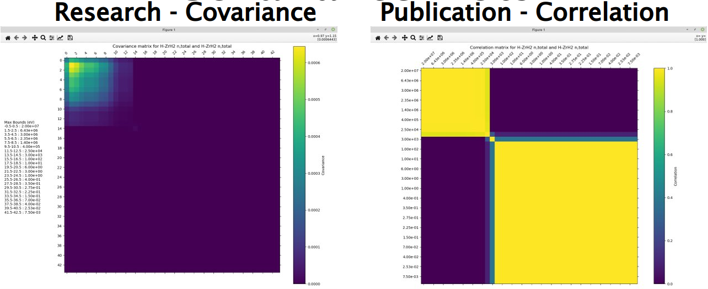

# scale_plots
Importable module for parsing sdf files from keno and storing the data in a Pandas DataFrame. The collected data can then be plotted for sensitivity vs energy or sensitivity per unit lethargy vs energy. A GUI for easier use is included by typing `python scale_plots/plots_gui.py` into the terminal while in the main `scale_plots/` directory.

Required python libraries:
* NumPy
* SciPy
* pandas
* Matplotlib
* PyQt5

To import the module add `PYTHONPATH="$PYTHONPATH:/path/to/scale_plots"` to your bashrc.

##Full GUI

You can comment out the function calls for initializing either sections.

### Sensitivity UI and Plots

* Can support multiple sdf files at once of either sdf file format.​
* Reaction selection allows resetting selections and changing the legend’s label for each reaction.
* Plotting options allows:​
    * Either error bars or fill between​
    * Indexing for energy bounds​
    * Correlation with text position​
    * Both sensitivity and sensitivity per unit lethargy​

### Covariance UI and Plots

* Works for multiple files. Currently tested on 44 and 56 group.​
* Reaction selection works much like the sensitivity.​
* Plotting options allows:​
    * 2 formats for the plots​
    * Indexing energy bounds​
    * Tick step to space x and y labels​
    * Color mapping selection​
    * Both covariance matrix and correlation matrix​

### Code Documentation
#### `class scale_plots.Plots()`
Object that contains the functions needed to parse and plot the data from a sdf file.

##### `scale_plots.Plots.sdf_to_df(filename)`
Parse the keno sdf output file into a pandas DataFrame.

Parameters:
* **filename** (str) - Name of the sdf file to parse.

Returns:
* **df** (pandas.DataFrame) - DataFrame containing all of the data needed for plotting from the sdf file.

##### `scale_plots.Plots.parse_coverx(filename)`
Parse the covariance matrix file. Save the matrices into a dictionary as well as the energy groups.
An exlanation of the file format is located in the parse_coverx jupyter notebook

Paramters:
* **filename** (str) - Name of the covariance file to parse.

##### `scale_plots.Plots.get_mat_name(matid)`
Translate the material ID into the name. IDs are mostly the same as MCNP IDs/1000 except for some special cases that scale made impossible to program without a dict.

##### `scale_plots.Plots.get_mt_name(mtid)`
Same as get_mat_name but used for reactions. Sorry if the names make no sense. I pulled directly from the Scale documentation. Check scale_ids.py for details.

##### `scale_plots.Plots.get_integral(filename)`
Returns the integral value of the sensitivity data and the uncertainty.

Parameters:
* **key** (list) - Indices in the pandas DataFrame where the desired sensitivities are stored.

Returns:
* **int_value** (float) - Integral value of the sensitivity data.
* **int_unc** (float) - Uncertainty of the integral value.

##### `scale_plots.Plots.get_corr(self, keys, elow=float('-inf'), ehigh=float('inf'), lethargy=False)`
Return the correlation coefficients for the given keys.

Parameters:
* **keys** (list of lists) - Indices in the pandas DataFrame where the desired data is stored.
* **elow** (float, *optional*) - The low bound for energies to calculate correlation. Defaults to -inf.
* **ehigh** (float, *optional*) - The high bound for energies to calculate correlation. Defaults to inf.
* **lethargy** (bool, *optional*) - Whether to find the correlation between sensitivites in unit lethargy. Defaults to False.

Returns:
* **r** (dict)
  - key - tuple of tuples for keys
  - value - correlation coefficient for the 2 reactions in the key

##### `scale_plots.Plots.sensitivity_plot(keys, plot_std_dev=True)`
Plot the sensitivity of the given `keys` from the pandas DataFrame stored in `scale_plots.Plots()`.
Default unit and region number are (0,0).

Parameters:
* **keys** (list of lists) - Indices in the pandas DataFrame where the desired sensitivities are stored.
* **elow** (float, *optional*) - The low bound for energies to plot. Defaults to -inf.
* **ehigh** (float, *optional*) - The high bound for energies to plot. Defaults to inf.
* **plot_err_bar** (bool, *optional*) - Whether the user wants the error bars to be included in the generated plot. Defaults to True.
* **plot_fill_bet** (bool, *optional*) - Whether the user wants the error bars to be included in the generated plot. Defaults to False.
* **plot_corr** (bool, *optional*) - Whether the user wants the error to be plotted as a fill between. Defaults to False.
* **legend_dict** (dictionary, *optional*)
  - keys - key in the keys list of the selected isotope
  - value - string to replace the automatically generated legend
* **r_pos** (str, *optional*) - Where the correlation coefficient should go on the plot. Defaults to 'bottom right'. Can also be 'top right', 'bottom left', and 'top left'.

##### `scale_plots.Plots.sensitivity_lethargy_plot(keys, plot_std_dev=True)`
Plot the sensitivity per unit lethargy of the given `keys` from the pandas DataFrame stored in `scale_plots.Plots()`
Default unit and region number are (0,0).

Parameters:
* **keys** (list of lists) - Indices in the pandas DataFrame where the desired sensitivities are stored.
* **elow** (float, *optional*) - The low bound for energies to plot. Defaults to -inf.
* **ehigh** (float, *optional*) - The high bound for energies to plot. Defaults to inf.
* **plot_err_bar** (bool, *optional*) - Whether the user wants the error bars to be included in the generated plot. Defaults to True.
* **plot_fill_bet** (bool, *optional*) - Whether the user wants the error bars to be included in the generated plot. Defaults to False.
* **plot_corr** (bool, *optional*) - Whether the user wants the correlation coefficient to be given in the plot. Defaults to False.
* **legend_dict** (dictionary, *optional*)
  - keys - key in the keys list of the selected isotope
  - value - string to replace the automatically generated legend
* **r_pos** (str, *optional*) - Where the correlation coefficient should go on the plot. Defaults to 'bottom right'. Can also be 'top right', 'bottom left', and 'top left'.

##### `scale_plots.Plots.heatmap_plot(mat_mt_1, mat_mt_2, filename, covariance=True, elow=float('-inf'), ehigh=float('inf'), cmap='viridis', tick_step=1, mode='publication', label1=None, label2=None)`
Create a heatmap of the covariance or correlation matrix for the selected material and reaction pairs.

Paramters:
* **mat_mt_1** (tuple) - The material and reaction id number for one of the cross sections.
* **mat_mt_2** (tuple) - The material and reaction id number for the second cross sections.
* **filename** (str) - Name of the file that where the matrix was found.
* **covariance** (bool, optional) - If true the covariance matrix is plotted. If false the correlation matrix is plotted. Defaults to false to plot covariance.
* **elow** (float, optional) - The low bound for energies to plot. Defaults to -inf.
* **ehigh** (float, optional) - The high bound for energies to plot. Defaults to inf.
* **cmap** (str, optional) - Color mapping to be used for heatmap. Can be set as any Matplotlib cmap.
* **tick_step** (int, optional) - How often the tick marks should be placed on axis.
* **mode** (str, optional) - Can be either 'research' or 'publication'. Research is geared towards finding the group and value for a matrix spot while publication looks more like the heatmaps found in published papers.
* **label1** (str, optional) - Desired text for the first nuclide and reaction.
* **label2** (str, optional) - Desired text for the second nuclide and reaction.
